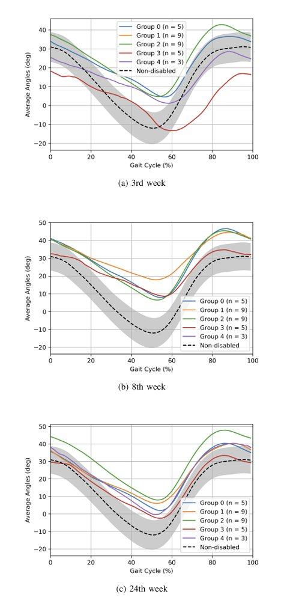

# Deep Temporal Clustering for Gait Recovery Patterns (DTCRP)

> **Deep Temporal Clustering for Long-Term Gait Recovery Patterns of Post-Stroke Patients using Joint Kinematic Data**  
> Published at *2025 11th International Conference on Computing and Artificial Intelligence (ICCAI)*  
> 📄 **Paper:** [IEEE Xplore](https://doi.org/10.1109/ICCAI66501.2025.00105) · DOI: `10.1109/ICCAI66501.2025.00105`  
> 🎓 **Thesis / Full Report:** [SKKU dCollection](https://dcollection.skku.edu/public_resource/pdf/000000184755_20260401134348.pdf)

<!-- 학위논문 링크 삽입 예시:
> 🎓 **Master's Thesis:** [Sungkyunkwan University Repository](https://YOUR_THESIS_LINK_HERE)
-->

---

## Overview

This repository contains the official implementation of the **DTCRP (Deep Temporal Clustering for Recovery Pattern)** model, which identifies long-term gait recovery patterns in post-stroke hemiplegic patients using joint kinematic time-series data.

The model combines a **Temporal AutoEncoder (TAE)** and a **Temporal Clustering Layer (C-layer)** in an end-to-end deep learning architecture to cluster longitudinal gait data — without manual feature extraction.

### Key Results

- Clustered 31 post-stroke patients into **5 distinct gait recovery groups**
- Achieved an average **Silhouette Score of 0.4256** at the optimal cluster count (n=5)
- Outperformed traditional baselines: k-means (Euclidean), k-means (DTW), and k-shape

---

## Architecture

```
Input Data (x)
    │
    ▼
┌─────────────────────────────────────────┐
│            Temporal AutoEncoder (TAE)   │
│  ┌──────────────────────┐               │
│  │       ENCODER        │               │
│  │  Conv1D + LeakyReLU  │               │
│  │     MaxPool1D        │               │
│  │   Bi-LSTM × 2        │               │
│  └──────────┬───────────┘               │
│             │ Latent Space (z)          │
│  ┌──────────▼───────────┐               │
│  │       DECODER        │               │
│  │      Upsample        │               │
│  │   ConvTranspose1D    │               │
│  └──────────────────────┘               │
└─────────────────────────────────────────┘
             │                    │
             ▼                    ▼
     Minimize MSE    ┌────────────────────┐
                     │  Temporal Cluster  │
                     │      Layer         │
                     │  (AgglomerativeC.  │
                     │   + t-distribution)│
                     └────────────────────┘
                              │
                              ▼
                      Minimize KL Divergence
```

**Joint Loss Function:**
```
L_total = α * L_rec + β * L_clus
```
where `L_rec` is MSE reconstruction loss and `L_clus` is KL divergence clustering loss.

---

## Repository Structure

```
DTCRP/
├── dtc_longitudinal.py          # Main training & evaluation script
├── models.py                    # TAE encoder/decoder & ClusterNet definitions
├── config1.py                   # Hyperparameter configuration (argparse)
├── load_long_custom_data.py     # Custom dataset loader for longitudinal gait data
├── utils.py                     # Similarity metrics for clustering
├── requirements.txt             # Dependency list
├── environment.txt              # Full conda environment snapshot
└── README.md                    # This file
```

---

## Environment & Requirements

| Component | Version |
|-----------|---------|
| OS | Ubuntu 22.04 LTS |
| CUDA | 11.8 |
| cuDNN | 8.7.0 |
| Python | 3.8.18 |
| PyTorch | 2.1.0 |
| pytorch-cuda | 11.8 |
| NumPy | 1.24.3 |
| Pandas | 2.0.3 |
| scikit-learn | 1.3.0 |
| matplotlib | 3.7.2 |
| tslearn | 0.6.2 |

Install dependencies:
```bash
pip install -r requirements.txt
```

> For the full conda environment snapshot, refer to `environment.txt`.

---

## Data Preparation

Place your gait data (Excel `.xlsx` format) in the `data/GaitCycleLong/` directory.

The loader (`load_long_custom_data.py`) expects:
- **Joint angle data** (Excel file, Sheet1) — one row per time point per patient visit
- **Joint angular velocity data** (Excel file, Sheet1) — same format

Update the file paths in `load_long_custom_data.py`:
```python
filename_angle = "data/GaitCycleLong/your_angle_file.xlsx"
filename_vel   = "data/GaitCycleLong/your_velocity_file.xlsx"
```

Each patient has **8 longitudinal measurement sessions** conducted at weeks **2, 3, 4, 6, 8, 10, 12, and 24** post-stroke. Due to patient dropout, early discharge, or incomplete gait cycles, some sessions may be missing.

---

## Missing Data Handling: Masking Mechanism

### Why masking?

Clinical longitudinal data inevitably contains missing sessions — patients may withdraw from the study, be discharged early, or fail to complete a valid gait cycle at a given time point. Naive imputation strategies (e.g., forward-filling, mean substitution) risk distorting the sensitive temporal structure of gait trajectories and introducing spurious recovery patterns. To avoid this, this study adopts a **binary masking approach** that allows the model to train on all available data while completely excluding missing positions from every loss computation.

### Step-by-step mechanism

The masking pipeline spans three files: `load_long_custom_data.py` (data preparation), `dtc_longitudinal.py` (training), and is transparent to `models.py` (forward pass).

#### 1. Sentinel substitution (`load_long_custom_data.py`)

All `NaN` entries (missing sessions) in the raw Excel data are replaced with the sentinel value `999` before any processing:

```python
df_total = df_total.fillna(999)   # NaN → 999 placeholder
```

This ensures the data remains a dense numeric tensor throughout the pipeline.

#### 2. Z-score normalization (`load_long_custom_data.py`)

The entire data matrix — including the `999` sentinels — is normalized via `TimeSeriesScalerMeanVariance` (mean=0, std=1). After normalization, the `999` sentinel maps to a large positive outlier value, which is **distinct from any real gait signal** and thus reliably detectable.

```python
X_scaled = TimeSeriesScalerMeanVariance().fit_transform(tensor_data.cpu().numpy())
```

#### 3. Binary mask construction (`load_long_custom_data.py`)

After reshaping to the final `(N_patients, 8_sessions, T)` tensor, the mask is built by checking for zero-valued entries. Valid data points are assigned `1`; missing (sentinel-derived) positions are assigned `0`:

```python
mask = np.where(X_re != 0, 1, 0).astype(float)
mask = torch.tensor(mask, dtype=torch.float)   # shape: (N, 8, T)
```

The mask has the **identical shape** as the input data tensor, enabling element-wise multiplication in the loss functions.

#### 4. Masked MSE loss — TAE pretraining (`dtc_longitudinal.py`)

During TAE pretraining, `nn.MSELoss(reduction='none')` computes an **element-wise** loss matrix of the same shape as the input. The mask is then applied via element-wise multiplication, zeroing out all missing positions before the mean is computed over valid entries only:

```python
loss_mse = loss_ae(inputs.squeeze(1), x_reconstr)          # element-wise MSE, shape (N, 8, T)
loss_mse = torch.sum(loss_mse * mask) / torch.sum(mask)    # mean over valid entries only
```

This ensures the autoencoder is trained **only on reconstruction error at observed time points**, and gradients from missing sessions never backpropagate.

#### 5. Masked losses — ClusterNet fine-tuning (`dtc_longitudinal.py`)

The same masking logic is applied to **both** loss components during end-to-end ClusterNet training:

```python
# MSE reconstruction loss (masked)
loss_mse = loss1(inputs.squeeze(1), x_reconstr)
loss_mse = torch.sum(loss_mse * mask) / torch.sum(mask)

# KL divergence clustering loss (masked)
loss_KL = kl_loss_function(P, Q)
loss_KL = torch.sum(loss_KL * mask) / torch.sum(mask)

# Joint loss
total_loss = loss_mse + loss_KL
```

By masking both terms, the cluster assignment probabilities Q and the target distribution P are also effectively conditioned on valid observations only.

### Summary diagram

```
Raw Excel data
    │
    │  NaN (missing session)
    ▼
fillna(999) ──────────────────────────────────────────────┐
    │                                                      │
    ▼                                                      ▼
Z-score normalization                          mask = (X_re != 0)
(999 → large outlier)                          shape: (N, 8, T)
    │                                               [1=valid, 0=missing]
    ▼
Reshape → X_re (N, 8, T)
    │
    ├──────────────────────────────────┐
    ▼                                  ▼
Forward pass (TAE / ClusterNet)     mask applied to loss
  → x_reconstr, Q, P               loss = Σ(loss_elem * mask) / Σ(mask)
                                    ✓ gradients only from valid sessions
```

> **Design rationale:** This approach is consistent with the strategy described in Liu et al. (2022, IEEE BIBM), which demonstrated that masking-based training outperforms imputation on health record data with irregular missingness — a setting closely analogous to this study's longitudinal clinical gait data.

---

## Quick Start

```bash
cd DTCRP/
python dtc_longitudinal.py
```

---

## Configuration & Tuning

### Random Seed
Modify `SEED` on **line 207** of `dtc_longitudinal.py`:
```python
SEED = 42  # Change this value to try different seeds
```

### Cluster Range
Modify **lines 238–239** of `dtc_longitudinal.py`:
```python
init_cluster = 3   # Starting number of clusters
end_cluster  = 10  # Ending number of clusters
```

### Hyperparameters
Modify **line 253** of `dtc_longitudinal.py`:
```python
hyper_dict = {
    'lr_ae':         [1e-4],   # Learning rate for TAE pretraining
    'lr_cluster':    [1e-8],   # Learning rate for clustering phase
    'max_epochs_ae': [100],    # Pretraining epochs
    'max_epochs_clu':[200],    # Clustering epochs
    'pooling':       [25],     # MaxPool1D pooling size
    'batch':         [8],      # Batch size
}
```

To run a grid search, add multiple values per key:
```python
hyper_dict = {
    'lr_ae':      [1e-3, 1e-4, 1e-5],
    'lr_cluster': [1e-7, 1e-8, 1e-9],
    'pooling':    [20, 25, 30],
    'batch':      [4, 8, 16],
    ...
}
```

---

## Outputs

| Output | Location | Description |
|--------|----------|-------------|
| Model weights (TAE) | `models_weights/GaitCycleLong/autoencoder_weight_n.pth` | Pretrained TAE weights |
| Model weights (Full) | `models_weights/GaitCycleLong/full_model_weigths_n.pth` | Full DTCRP weights |
| Silhouette results | `results/result_*.xlsx` | Per-cluster silhouette scores |
| Hyperparameter summary | `results_tot/result_total_C5.xlsx` | All hyperparameter trial results |
| Best hyperparameters | `results_tot/result_total_max_C5.xlsx` | Best config per cluster count |
| Loss curves | `figures/YYMMDD/*.png` | Training loss plots (per run) |
| Cluster assignments | `data/pickle/YYMMDD/*.pkl` | Patient-to-cluster mapping |

---

## Optimal Hyperparameters (from paper)

| Hyperparameter | Value |
|----------------|-------|
| Pre-training epochs | 100 |
| Fine-tuning epochs | 200 |
| Batch size | **8** |
| Learning rate (TAE) | **1e-4** |
| Learning rate (Clustering) | **1e-8** |
| Pooling size | **25** |
| Hidden size (Bi-LSTM 1) | 50 |
| Hidden size (Bi-LSTM 2) | 1 |
| Optimizer | SGD (momentum=0.9) |

---

## Results & Visualization

### Silhouette Score vs. Number of Clusters

The grid search over cluster counts (n = 3 to 10) shows that **n = 5** achieves the best balance between silhouette score and cluster distribution uniformity.

| Algorithm | 3 | 4 | **5** | 6 | 7 | 8 | 9 | 10 |
|-----------|---|---|-------|---|---|---|---|----|
| k-means (Euclidean) | 0.097 | 0.090 | 0.151 | 0.162 | 0.164 | 0.130 | 0.143 | 0.155 |
| k-means (DTW) | 0.102 | 0.046 | 0.058 | 0.003 | 0.004 | -0.017 | 0.014 | 0.012 |
| k-shape | 0.135 | 0.108 | 0.071 | 0.065 | 0.074 | 0.082 | 0.042 | 0.011 |
| **DTCRP (ours)** | **0.853** | **0.419** | **0.426** | **0.411** | **0.311** | **0.389** | **0.295** | **0.377** |

> Results may vary slightly across machines due to PyTorch's stochastic internals. If results differ significantly, verify your environment against `requirements.txt`.

---

### Long-Term Hip Angle Recovery Trajectories by Group

The figure below shows the **average hip joint angle trajectories** on the affected side across 5 recovery groups, compared against non-disabled reference data (black dashed line ± 1 SD shaded region). Trajectories are shown at three clinical time points: 3rd, 8th, and 24th week post-stroke.

<p align="center">
  
</p>

<p align="center">
  <em>Figure: Average hip angle trajectories (affected side) per recovery group at weeks 3, 8, and 24 post-stroke.<br>
  Groups: Group 0 (n=5), Group 1 (n=9), Group 2 (n=9), Group 3 (n=5), Group 4 (n=3).<br>
  Dashed line = non-disabled reference. Shaded region = ±1 SD of non-disabled.</em>
</p>

**Key observations:**
- **Group 3** shows the most severe early-stage deviation from normative gait but achieves the greatest long-term recovery by week 24, most closely approximating the non-disabled trajectory.
- **Group 2** starts near the non-disabled baseline but gradually diverges over time, suggesting less effective long-term intervention outcomes.
- **Group 1** (largest group, n=9) maintains a broadly consistent trajectory throughout the rehabilitation period.
- By **week 24**, most groups converge toward the non-disabled reference range, reflecting overall rehabilitation progress.

> Additional joint-level plots (knee, ankle) and spatiotemporal metric analyses can be found in the paper.

---

## Citation

If you use this code in your research, please cite:

```bibtex
@inproceedings{teng2025dtcrp,
  title     = {Deep Temporal Clustering for Long-Term Gait Recovery Patterns of Post-Stroke Patients using Joint Kinematic Data},
  author    = {Teng, Teh-Hao and Kim, Gyeongmin and Kim, Hyungtai and Choi, Mun-Taek},
  booktitle = {2025 11th International Conference on Computing and Artificial Intelligence (ICCAI)},
  pages     = {654--658},
  year      = {2025},
  doi       = {10.1109/ICCAI66501.2025.00105}
}
```

---

## Acknowledgements

This study was supported by the **Translational Research Program for Rehabilitation Robots (NRCTR-EX23002)**, National Rehabilitation Center, Ministry of Health and Welfare, Republic of Korea.

---

## License

This project is intended for academic and research use. Please refer to the paper for details on the dataset (Samsung Medical Center IRB: SMC 2017-11-081).
